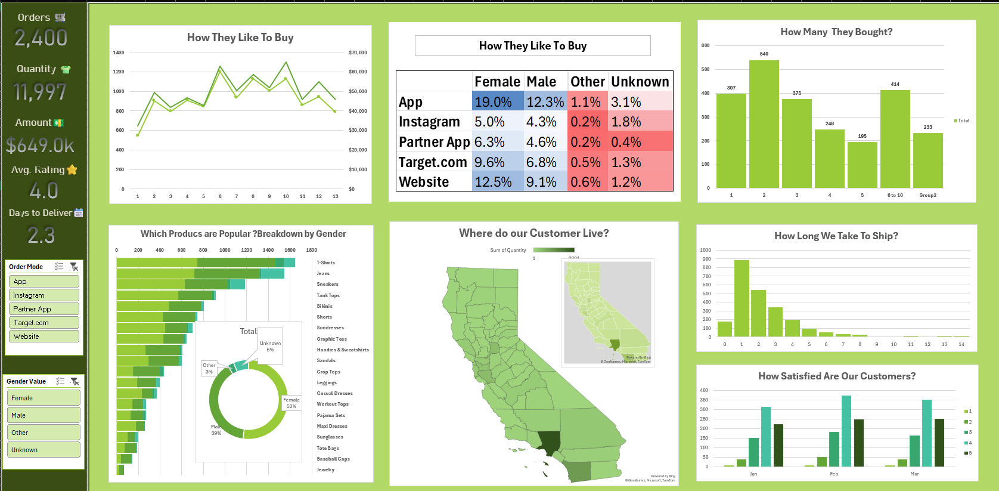
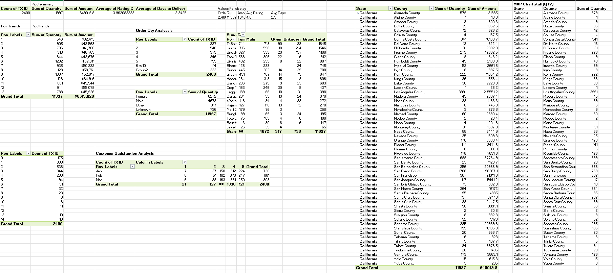
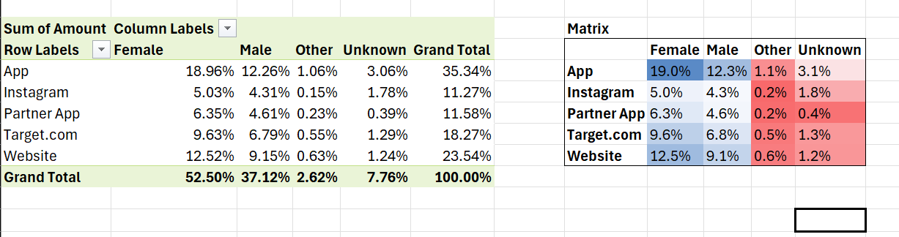
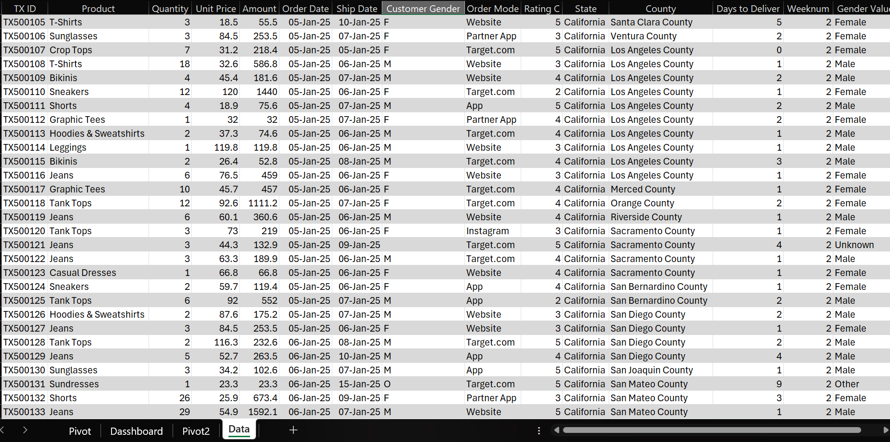

# 📊 E-Commerce Sales Dashboard

## 📌 Project Overview

This project analyzes e-commerce sales data using Microsoft Excel. The dashboard was created to transform raw sales data into meaningful business insights through data cleaning, Pivot Tables, and data visualization.

## 🛠 Tools Used

* Microsoft Excel
* Pivot Tables
* Pivot Charts
* Data Cleaning
* Dashboard Design

## 📈 Project Workflow

### 1️⃣ Data Cleaning

Prepared and cleaned the dataset to ensure accurate analysis and reporting.

### 2️⃣ Data Analysis

Created Pivot Tables to analyze sales trends and business performance.

### 3️⃣ Dashboard Creation

Built an interactive dashboard to visualize key insights from the dataset.

## 📷 Project Screenshots

### Dashboard Overview

### Sales Analysis Pivot Table - 1 

###  Pivot Table - 2

### Data Cleaning Process

## 🎯 Skills Demonstrated

* Data Cleaning
* Data Analysis
* Pivot Tables
* Dashboard Design
* Data Visualization
* Business Insights

## 👩‍💻 Author

**Pudi Roshitha**

Data Science Student | Learning Data Analytics

Excel • SQL • Python • Power BI

